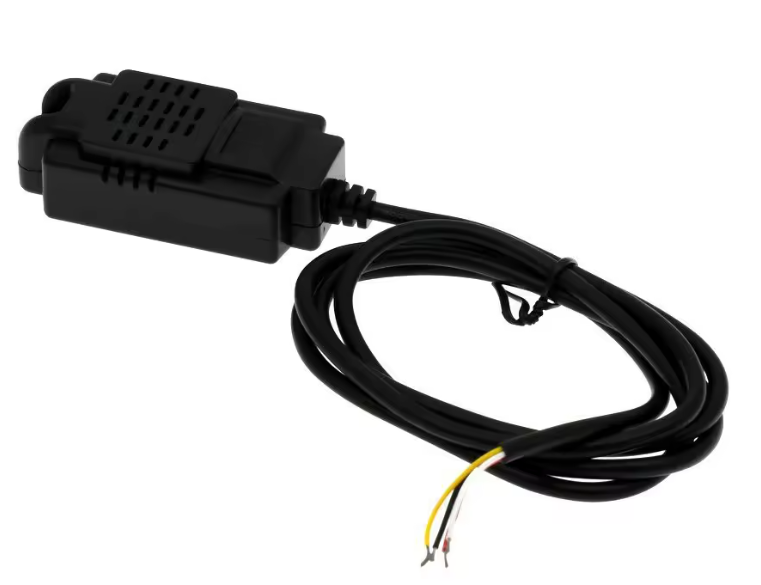
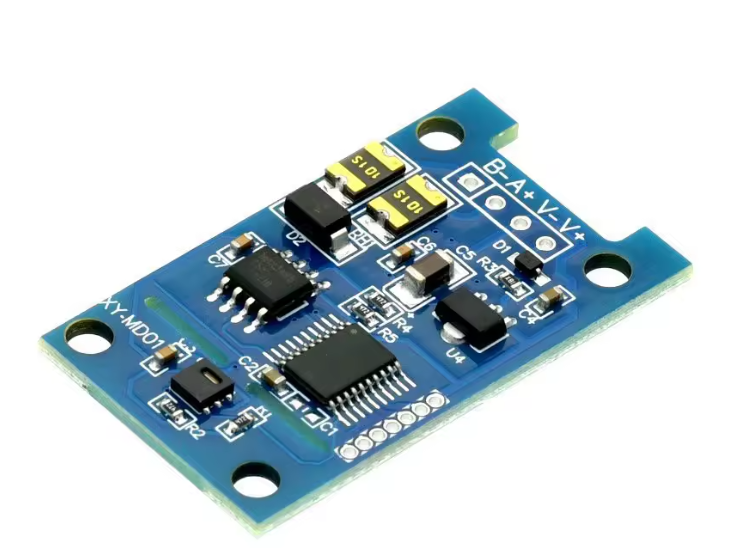
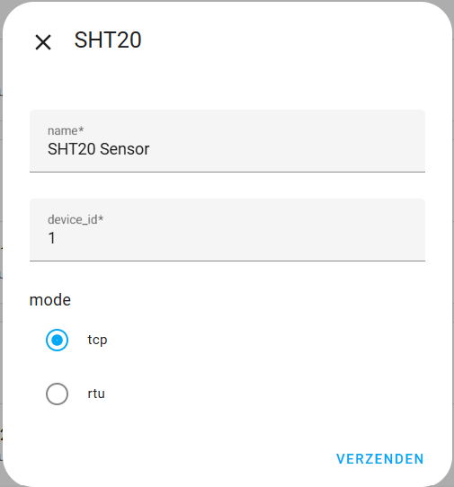
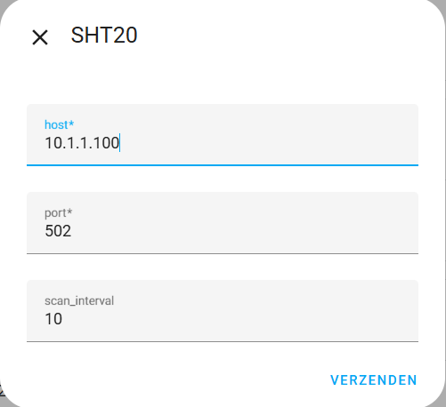
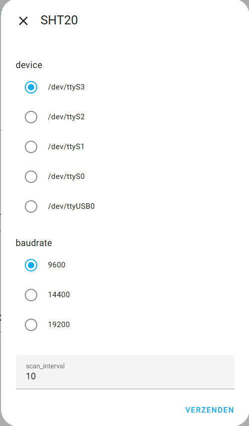
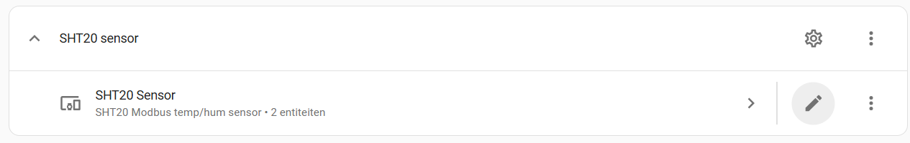
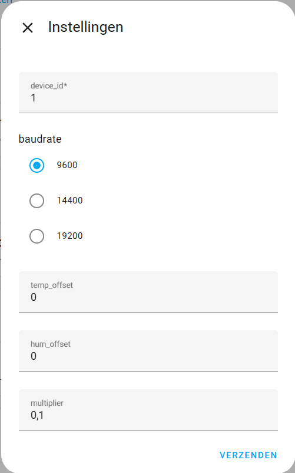

# 🧩 SHT20 Modbus Sensor Integration for Home Assistant

This custom Home Assistant integration enables you to easily connect and configure **SHT20 Modbus RS485 sensors** (models **XY-MD01** / **XY-MD02**) using either:

- A **direct serial connection** (e.g. USB RS485 adapter)  
- A **TCP/IP to RTU gateway** (e.g. Ethernet to RS485 bridge)

These sensors can be purchased via **AliExpress** and, in the Netherlands, via the **Domoticx** webshop:  
[https://domoticx.net/webshop/modbus-rs485-rtu-temphum-sensor-9-36vdc-xy-md01-sht20/](https://domoticx.net/webshop/modbus-rs485-rtu-temphum-sensor-9-36vdc-xy-md01-sht20/) 
(*If you know any other shops? drop a line in the discussions*)

The setup is fully UI-driven via Home Assistant's `config_flow`, requiring no YAML editing. Users can fine-tune sensor calibration and scaling — all within the frontend.

---

## ⚙️ Key Features

  

- **Flexible connection modes**:
  - **Serial**: Supports devices like `/dev/ttyUSB0`
  - **TCP/IP**: Connect to gateways over LAN using IP and port  

- **Modbus setup options**:
  - Define **slave ID**, **baudrate**, and **transport method**
  - Serial setup simplified (no parity needed)

- **Per-sensor customization**:
  - Adjustable **offsets** for temperature and humidity
  - Optional **scaling factor** for sensor-specific calibration

- **Dynamic UI**:
  - Configuration forms change based on connection type
  - Supports **multiple sensors** with individual settings

- **Options Flow**:
  - Modify offsets, scaling, and polling intervals after setup
  - Cleanly separate initial setup from ongoing tuning

---

## 📦 Installation via HACS

  

To install this custom integration using the **Home Assistant Community Store (HACS)**:

1. **Open HACS** in Home Assistant  
2. Go to the **"Integrations"** section  
3. Click the **three-dot menu (⋮)** in the upper right and select **"Custom repositories"**  
4. Paste in the repository URL ([https://github.com/remmob/sht20modbus](https://github.com/remmob/sht20modbus))  
5. Set the repository type to **"Integration"**  
6. Click **Add**, then search for `SHT20` in the integrations list  
7. **Install** the integration  
8. **Restart Home Assistant**  
9. Go to **Settings → Devices & Services → Add Integration**, and search for `SHT20`

That’s it! 🎉 The UI will guide you through connecting and configuring your sensor(s).
--- 
## 🛠️ The Setup

- Give the sensor a name  
- Assign a device ID (Modbus address, default = 1)  
- Choose either **TCP** (through a Modbus gateway) or **RTU** (serial)  
- Click **Submit**

- In the **TCP setup**, enter a valid IP address  
- Set the TCP port (default = 502)  
- Define the scan interval (default = 10 seconds)  
- Click **Submit**

- In the **RTU setup**, select the serial port used by the device  
- All available ports are automatically listed  
- Choose the baud rate (default = 9600)  
- Set the scan interval (default = 10 seconds)  
- Click **Submit**

After submitting, the integration attempts to contact the sensor  
and retrieve the optional settings.  
You can then edit these by clicking the ⚙️ gear icon in the integration overview.

---

## ⚙️ Options

 
Click the gear icon in the SHT20 integration overview to edit the options.

 

**Available options:**
- Device ID  
- Baud rate  
- Temperature offset between **-10.0°C** and **+10.0°C**  
- Humidity offset between **-10.0%** and **+10.0%**

These values are written directly to the device's Modbus registers  
and synchronized with Home Assistant.

💡 *Note:* Some sensors (e.g. PCB-only versions) return raw values  
    using a different multiplier. By default, a multiplier of **0.1** (÷10) is applied.  
    If no scaling is required, change the multiplier to **1**.
