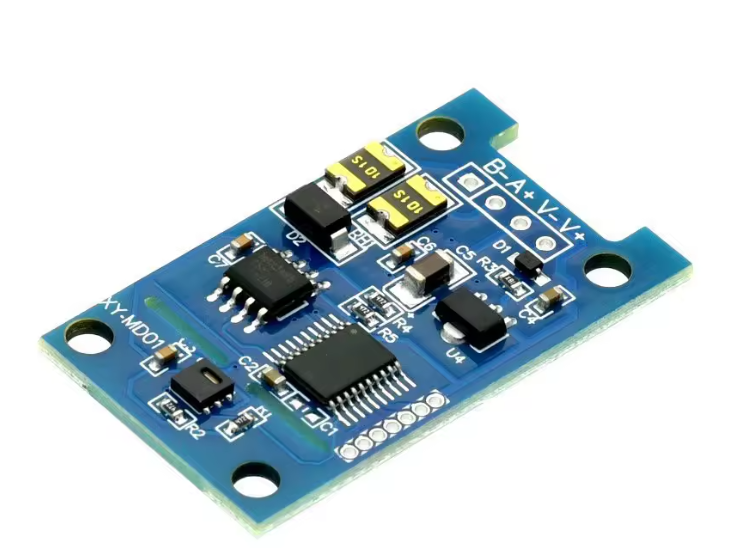
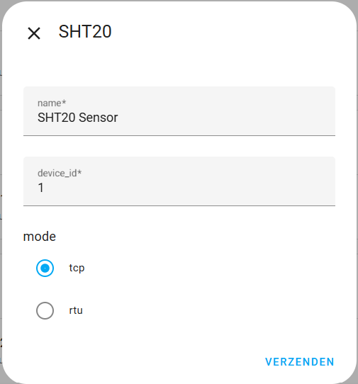
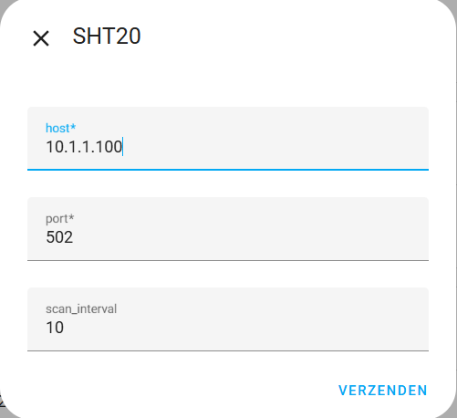
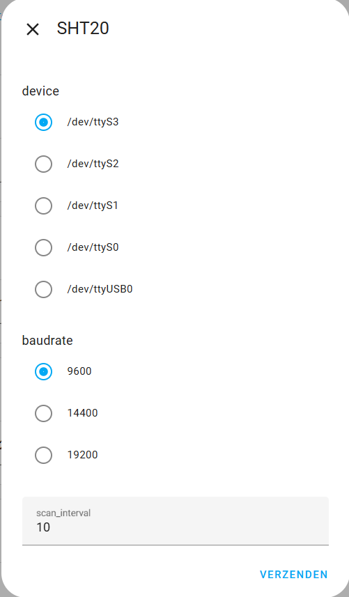
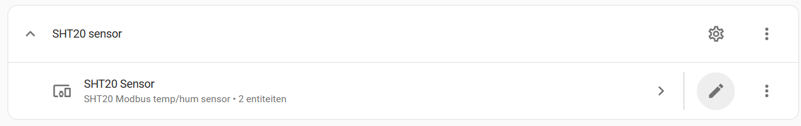
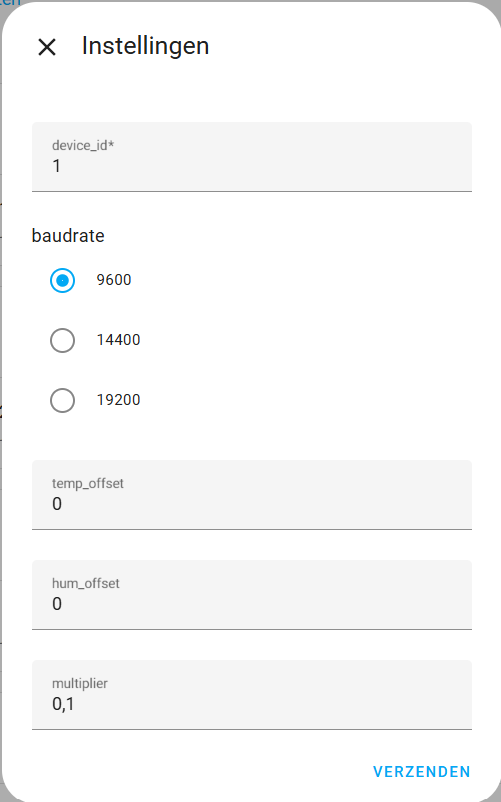

   

# 🧩 SHT20 Modbus Sensor-integratie voor Home Assistant

Een custom Home Assistant-integratie om **SHT20 Modbus RS485-sensoren** (modellen **XY-MD01** / **XY-MD02**) volledig via de UI te verbinden en in te stellen — geen YAML.

  

Verbind je sensor op één van drie manieren:

- **Serieel (RTU)** – bijv. een USB → RS485-adapter
- **TCP** – via een Ethernet/WiFi → RS485-gateway
- **UDP** – voor gateways die over UDP communiceren *(nieuw in v1.1.0)*

Deze sensoren zijn te koop via **AliExpress** en, in Nederland, via de **Domoticx**-webshop:
[domoticx.net – XY-MD01 / SHT20](https://domoticx.net/webshop/modbus-rs485-rtu-temphum-sensor-9-36vdc-xy-md01-sht20/)
(*Ken je een andere shop? Laat het weten in de discussions.*)

Instellen en bijregelen gaat volledig via Home Assistant's `config_flow`, inclusief kalibratie die rechtstreeks naar de sensor wordt geschreven.

---

## ⚙️ Belangrijkste functies

- **Drie verbindingsmethodes** — Serieel (RTU), TCP en UDP, allemaal via de UI in te stellen.
- **Temperatuur & luchtvochtigheid** rechtstreeks uit de Modbus-registers van de sensor.
- **Vier berekende comfort-sensoren** — dauwpunt, absolute luchtvochtigheid, enthalpie en gevoelstemperatuur, afgeleid uit de live metingen.
- **Verbindingsbewaking** — krijg een melding als de sensor niet meer reageert, met een automatisch herstelbericht zodra hij terug is.
- **Stille uren** — houd mobiele meldingen tegen tijdens een ingestelde periode (bijv. 's nachts) en lever ze daarna alsnog af.
- **Kalibratie op de sensor** — temperatuur- en vochtigheidsoffsets en het apparaat-ID/de baudrate worden rechtstreeks naar de sensor geschreven.
- **Altijd herconfigureerbaar** — pas alles later aan via het options-scherm; de integratie hoeft niet verwijderd en opnieuw toegevoegd te worden.
- **Meerdere sensoren**, elk met eigen instellingen.
- **Nederlandse en Engelse** vertaling van de UI.

---

## 🌡️ Berekende sensoren

Naast de ruwe **temperatuur** en **luchtvochtigheid** voegt de integratie vier sensoren toe die live worden berekend:

| Sensor | Wat het je vertelt |
| --- | --- |
| **Dauwpunt** | De temperatuur waarbij de lucht begint te condenseren. |
| **Absolute luchtvochtigheid** | De werkelijke hoeveelheid water in de lucht (kg water / kg droge lucht). |
| **Enthalpie** | De totale warmte-inhoud van de lucht (kJ/kg). |
| **Gevoelstemperatuur** | Hoe warm de lucht *aanvoelt*, op basis van temperatuur en vochtigheid. |

De berekeningen gebruiken een instelbare **luchtdruk** (standaard 1013,25 hPa) voor extra nauwkeurigheid.

---

## 📦 Installatie

  

### HACS (standaard store)

SHT20 Modbus is beschikbaar in de [HACS](https://hacs.xyz) standaard store.

1. Open **HACS** in Home Assistant.
2. Zoek op **SHT20** en open het (of gebruik de knop hierboven).
3. Klik op **Downloaden**.
4. **Herstart Home Assistant**.

### HACS (custom repository)

1. Open **HACS** in Home Assistant.
2. Klik op het menu met de drie puntjes (⋮) rechtsboven.
3. Kies **Custom repositories**.
4. Voeg deze repository-URL toe: `https://github.com/remmob/sht20modbus`.
5. Zet de categorie op **Integration** en klik op **Add**.
6. Zoek op **SHT20** en download het.
7. **Herstart Home Assistant**.

Zie de [officiële HACS documentatie](https://hacs.xyz/docs/faq/custom_repositories/) voor meer details.

### Handmatig

1. Download of kopieer de map `sht20` uit deze repository: [`custom_components/sht20`](custom_components/sht20)
2. Plaats deze map in je Home Assistant installatie onder: `config/custom_components/sht20`
3. **Herstart Home Assistant**.

Na installatie ga je naar **Instellingen → Apparaten & diensten → Integratie toevoegen** en zoek je op **SHT20**. Klaar! 🎉 De UI leidt je door het verbinden en instellen van je sensor(en).

---

## 🛠️ Instellen

- Geef de sensor een **naam**.
- Stel het **apparaat-ID** in (Modbus-adres, standaard = 1).
- Kies de **verbindingsmethode**: **TCP**, **UDP** of **RTU** (serieel).
- Klik op **Verzenden**.

**TCP / UDP**

- Vul het **IP-adres** van je gateway in.
- Stel de **poort** in (standaard = 502).
- Stel het **scan-interval** in (standaard = 10 seconden).
- Klik op **Verzenden**.

**RTU (serieel)**

- Kies de **seriële poort** (alle beschikbare poorten worden automatisch getoond).
- Kies de **baudrate** (standaard = 9600).
- Stel het **scan-interval** in (standaard = 10 seconden).
- Klik op **Verzenden**.

Na het verzenden neemt de integratie contact op met de sensor en leest de huidige instellingen terug, die je daarna kunt bijstellen via het ⚙️-tandwiel.

---

## ⚙️ Opties

 
Klik op het tandwiel bij de SHT20-integratie om de opties te openen.

> ℹ️ *De onderstaande options-screenshot toont de layout van vóór 1.1.0. Het huidige scherm bevat ook de luchtdruk en de meldingsinstellingen die hieronder beschreven staan.*

 

**Beschikbare opties**

- **Apparaat-ID** en **baudrate** — worden naar de sensor geschreven; het formulier is vooraf ingevuld met de waarden die de sensor op dat moment rapporteert.
- **Temperatuuroffset** (−10,0 … +10,0 °C) en **vochtigheidsoffset** (−10,0 … +10,0 %).
- **Luchtdruk** (hPa) — gebruikt door de berekende sensoren.
- **Multiplier** — schaling voor de ruwe waarden. Standaard **0.01** (de sensor rapporteert honderdsten, bijv. `2572` → `25,72`). Zet op **1** als er geen schaling nodig is.
- **Meldingen bij verbindingsfouten** — zie hieronder.

De integratie schrijft alleen naar de sensor wanneer een waarde die op het apparaat staat daadwerkelijk is gewijzigd, en herlaadt automatisch zodat nieuwe instellingen meteen actief zijn.

---

## 🔔 Verbindingsmeldingen & stille uren

De SHT20 heeft geen alarmregisters, maar kan de verbinding verliezen. De integratie bewaakt dat en kan je op de hoogte stellen:

- **Mobiele app-melding**, **persistente melding** en/of een **notify-service** naar keuze.
- Een instelbare **vertraging** — pas melden nadat de sensor *x* seconden onbereikbaar is, om korte haperingen te negeren.
- Een automatisch **herstelbericht** zodra de communicatie is hersteld.
- **Stille uren** — tijdens de ingestelde periode worden mobiele meldingen vastgehouden en pas afgeleverd zodra de stille periode voorbij is. Persistente meldingen worden nooit vastgehouden.

Dit is allemaal optioneel en standaard uitgeschakeld; zet aan wat je nodig hebt via het options-scherm.

---

## 💡 Opmerkingen

- Sommige sensoren (bijv. kale-print-versies) rapporteren ruwe waarden met een andere multiplier. De standaard-multiplier is **0.01**; pas 'm aan als je metingen een factor tien afwijken.

---

©2026 Bommer Software | Auteur: Mischa Bommer
